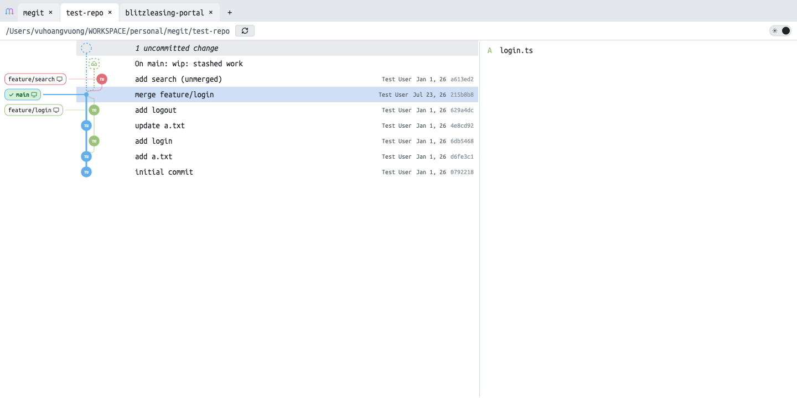

#  megit

Git repository viewer in the browser: commit graph with branch lanes, stashes, tabs for multiple repos, and diffs (unified or side-by-side) — including your uncommitted WIP. It also writes: stage/unstage/discard, commit and amend, branch and tag create/delete, stash push/pop/drop, checkout (with auto-stash when the worktree is dirty), plus revert, reset, cherry-pick, merge, rebase, pull and push.



## Requirements

- Node ≥ 24 (runs TypeScript directly via native type-stripping)
- pnpm

## Run

```bash
pnpm install
pnpm dev        # Express API on :4500 + Vite dev server on :4000
```

Production:

```bash
pnpm build      # vite → dist/
pnpm start      # serves dist/ + API on http://127.0.0.1:4500
```

Ports are configurable via `PORT` (API, default 3411) and `UI_PORT` (Vite dev server, default 5173); the dev/start scripts pin 4500/4000.

## Usage

Open the app, hit “+” in the tab bar, browse to a local git repository, Open. Each repo lives in its own tab.

- Commit graph with lanes, incremental “Load more” paging
- Sticky WIP row on top — staged, unstaged, and untracked changes
- Click a commit → changed files → per-file diff; merge commits diff against the first parent
- Unified ⇄ side-by-side toggle, `r` or ⟳ to refresh
- Auto-refresh — the server watches each open repo (`fs.watch` + SSE); the graph and WIP row update within ~1 s of any change. Manual refresh (`r`) still works.
- `⌘F` to search commits — filters the rows already loaded as you type (message, author, hash prefix or ref name), `Enter` / `Shift+Enter` walk the matches. The globe button re-runs the same query as a full-history `git log` search and loads the graph down to a match that sits below the loaded rows.

Keyboard: `⌘F` search · `Esc` close search · `↑`/`↓` move the selected row · `r` refresh · `⌘J` terminal · `⌘⇧0` light/dark.

Repo list persists in `~/.config/megit/config.json`.

## Development

```bash
pnpm test           # vitest (parsers, lane layout)
npx tsc --noEmit    # typecheck
```
