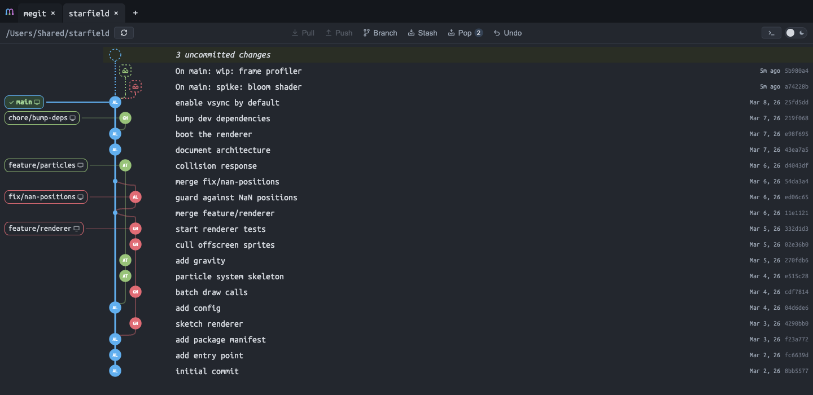
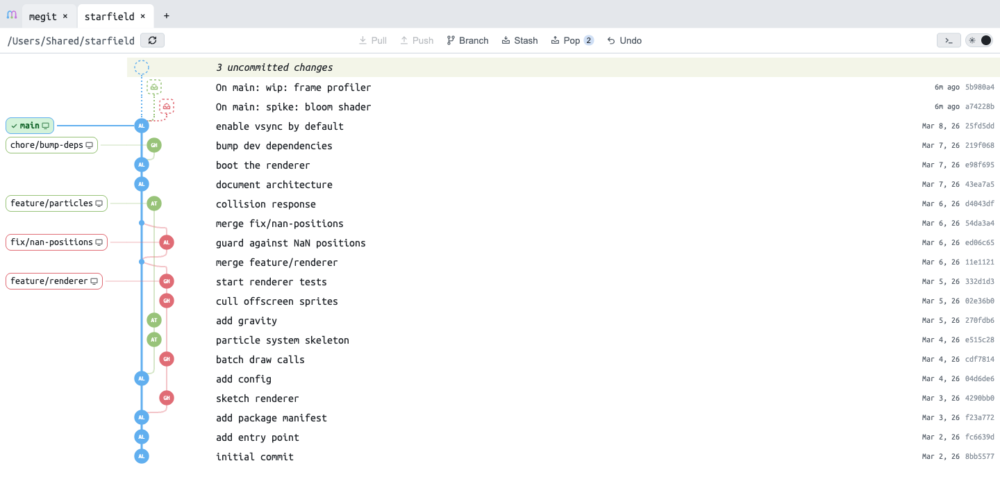
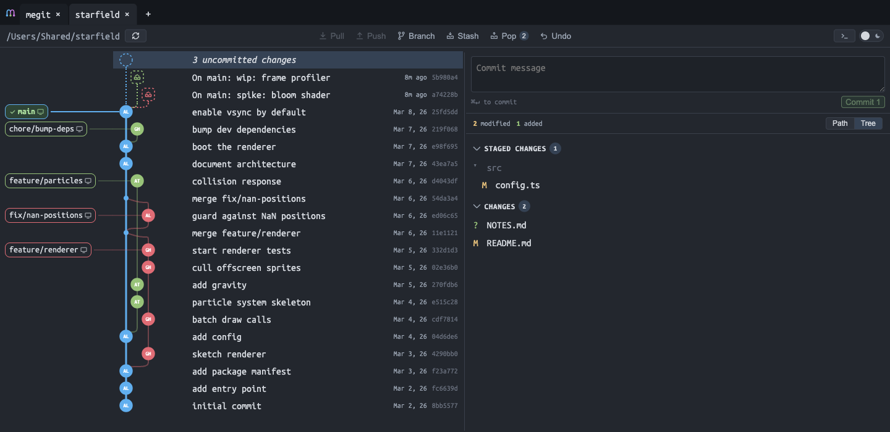
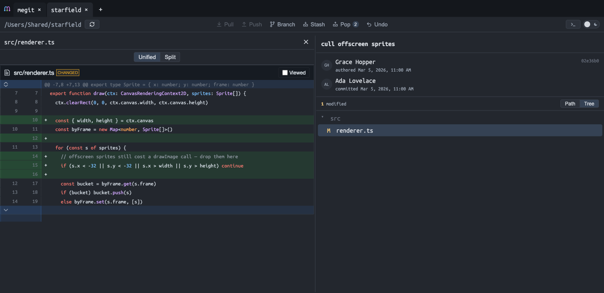
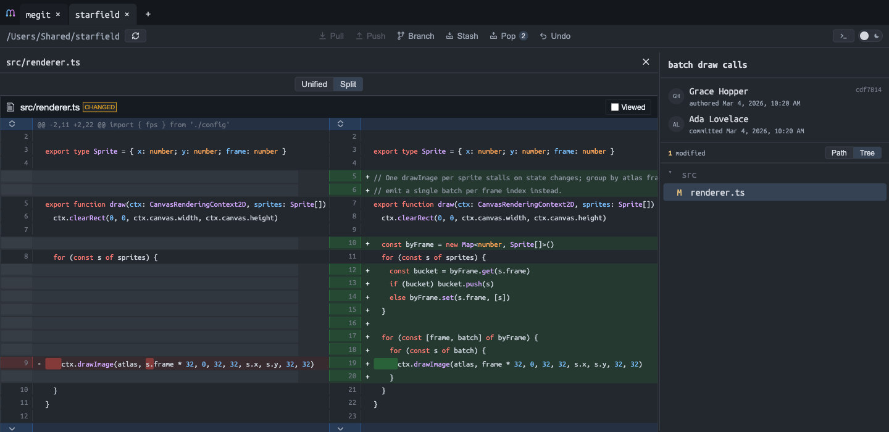
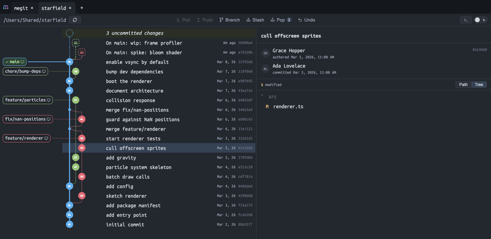
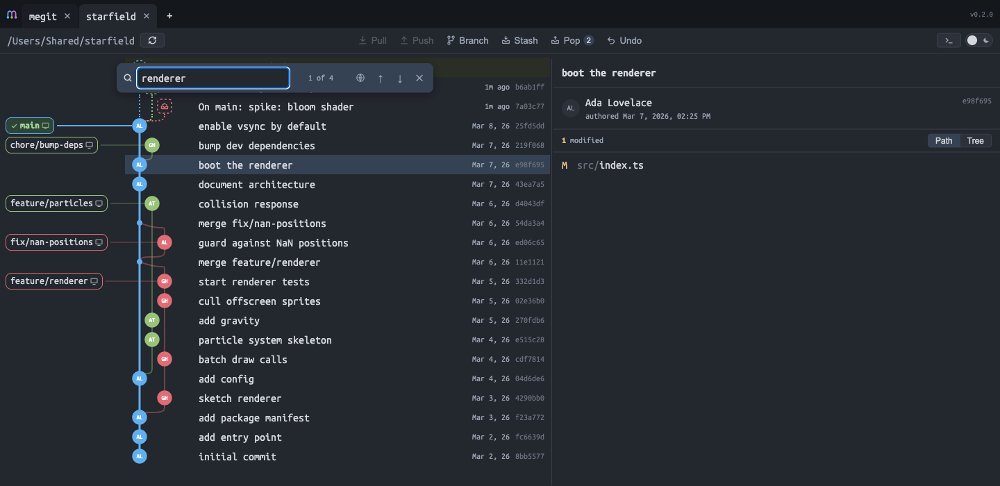
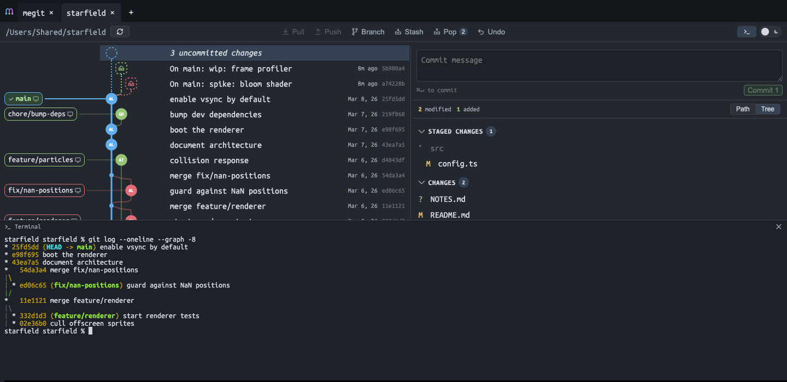

#  megit

[](https://www.npmjs.com/package/megit-app) [](https://github.com/vuongvu1/megit/actions/workflows/ci.yml) [](https://socket.dev/npm/package/megit-app)

A git repository viewer that runs in your browser. Commit graph with real branch lanes, diffs including your uncommitted work, stashes, staging, search, and a shell — pointed at as many local repos as you like, each in its own tab.

It writes, too: stage/unstage/discard, commit and amend, branch and tag create/delete, stash push/pop/drop, checkout (with auto-stash when the worktree is dirty), plus revert, reset, cherry-pick, merge, rebase, pull and push.



## Getting started

Requires Node ≥ 22. The package is 1.8 MB, with `ws` as its only runtime dependency and no install scripts.

```bash
npx megit-app
```

That starts the server on port 3411 — set `PORT` to change that — and opens your browser at it. <kbd>Ctrl</kbd><kbd>C</kbd> stops it.

**To keep it running after you close the terminal:**

```bash
npx megit-app start
npx megit-app stop
```

Or install it once with `npm i -g megit-app` and run `megit`, `megit start` and `megit stop` from anywhere; upgrade later with `npm i -g megit-app@latest`.

<sub>The package is `megit-app`; `megit` on npm is unrelated, so keep the `-app`. The installed command is still `megit`.</sub>

## Features

### Commit graph with lanes

Branches get their own colour and lane. The checked-out branch's path is drawn thicker so you can follow it at a glance, and merges bulge around the lanes they cross instead of cutting through them. Commits page in 200 at a time and load more on demand, so opening a repository never waits on the full history.

Ref chips sit in their own resizable column to the left — local branches, remotes, and tags — and the graph column and message column can be dragged to whatever widths suit the repo.

### Light and dark themes

Toggle with the switch in the toolbar or <kbd>⌘</kbd><kbd>⇧</kbd><kbd>0</kbd>. The choice persists.



### Uncommitted work is part of the graph

A sticky WIP row sits at the top of the list whenever the worktree is dirty, connected into HEAD like any other node. Click it to stage, unstage, or discard individual files, write a message, and commit — staged and unstaged changes are separate collapsible sections with counts.



Stashes appear as their own rows, attached to the commit they were taken from with a dotted connector, and can be popped, deleted, or retitled in place.

### Diffs

Click a commit to see its changed files, then a file to see the diff. Syntax highlighting, word-level intra-line highlighting, collapsed context you can expand a hunk at a time, and a per-file "Viewed" checkbox.

**Unified:**



**Split**, side by side:



Merge commits diff against their first parent. Images diff visually rather than as binary noise. Untracked files diff too, via `git diff --no-index`.

### Commit detail

Author and committer are shown separately when they differ — including the dates, which is the bit most tools hide. The changed-file list toggles between a flat path list and a directory tree.



### Search

<kbd>⌘</kbd><kbd>F</kbd> opens a find bar that filters the rows already loaded, as you type — matching commit message, author name, email, hash prefix, or ref name. That costs no request and can't go stale when the graph refreshes underneath you. <kbd>↵</kbd> and <kbd>⇧</kbd><kbd>↵</kbd> walk the matches, wrapping at the ends the way a find bar should.



If what you want is further back than the rows you've loaded, the globe button re-runs the same query as a full-history `git log` search. Because git ANDs its commit-limiting options, "message OR author OR hash" is three searches unioned into one date-ordered list, capped at 500 results — the counter shows `12 of 340 · all`, and `340+` when the cap truncated it. A match below the loaded window pulls the graph down to it.

### A real shell, in the repo

<kbd>⌘</kbd><kbd>J</kbd> opens a full PTY already `cd`'d into the active repository — your shell, your prompt, your aliases. It survives panel hides and tab switches, and <kbd>⌘</kbd><kbd>K</kbd> clears it. xterm.js is lazy-loaded, so it costs nothing until you open it.



### Git operations

megit started as a viewer, but the common operations are here:

- **Toolbar** — pull (fast-forward only), push, create branch, stash all, pop latest stash, undo last commit (soft reset, keeps changes staged)
- **Ref chips** — checkout, create branch here, rename, delete, set upstream, merge, rebase, delete tag, copy name, copy GitHub link
- **Commit rows** — checkout, cherry-pick, revert, reset (soft / mixed / hard), copy hash, copy GitHub link
- **Files** — stage, unstage, discard, amend the last commit's message

Checkout auto-stashes a dirty worktree first. Destructive items are marked as such and are hidden where they'd be meaningless.

### Auto-refresh

The server watches each open repository (`fs.watch`, filtered and debounced) and pushes changes to the browser over SSE. Commit in your terminal and the graph updates within about a second.

Auto-refresh only ever reads local git, so commits pushed by someone else stay invisible until something fetches. <kbd>r</kbd> and the ⟳ button therefore fetch from the remote first, then refresh — that is the one path that surfaces new upstream commits and refreshes the Pull/Push badges. A fetch that fails (offline, no remote) is ignored and the local refresh still happens.

### Keyboard

| Key                                                      | Action                             |
| -------------------------------------------------------- | ---------------------------------- |
| <kbd>↑</kbd> <kbd>↓</kbd> <kbd>Home</kbd> <kbd>End</kbd> | move through rows                  |
| <kbd>⌘</kbd><kbd>F</kbd>                                 | search commits                     |
| <kbd>↵</kbd> / <kbd>⇧</kbd><kbd>↵</kbd>                  | next / previous match              |
| <kbd>r</kbd>                                             | fetch from remote, then refresh    |
| <kbd>⌘</kbd><kbd>J</kbd>                                 | toggle terminal                    |
| <kbd>⌘</kbd><kbd>K</kbd>                                 | clear terminal                     |
| <kbd>⌘</kbd><kbd>⇧</kbd><kbd>0</kbd>                     | toggle theme                       |
| <kbd>⌘</kbd><kbd>↵</kbd>                                 | commit                             |
| <kbd>Esc</kbd>                                           | close search or menu / cancel edit |

## Platform support

| Platform             | Status                                             |
| -------------------- | -------------------------------------------------- |
| macOS (arm64, x64)   | full                                               |
| Windows (arm64, x64) | untested on real hardware; auto-refresh unverified |
| Linux                | everything except the built-in terminal            |

The terminal needs [node-pty](https://github.com/microsoft/node-pty), which ships prebuilt binaries for macOS and Windows only. It is an `optionalDependency`: on Linux the install either compiles it from source (needs python3 and a C++ toolchain) or skips it, and megit hides the terminal button. Nothing else is affected.

On Windows, the watcher integration tests crash the test worker outright, so they are skipped there and auto-refresh is not exercised by CI. Everything else in the suite runs. If you use megit on Windows, please report whether the graph updates on its own after a commit — that is the part we cannot currently verify.

## Configuration

The list of open repositories lives in `~/.config/megit/config.json`. Repositories are only reachable through the API if they are registered there, so pointing megit at a repo is always an explicit act.

## Development

Requires Node ≥ 24 and pnpm — a development-only floor, since the server runs its TypeScript unbuilt (the published package ships compiled JS and only needs Node ≥ 22).

```bash
pnpm install
pnpm dev        # API on :4500 + Vite dev server on :4000
```

Production build:

```bash
pnpm build          # vite → dist/
pnpm build:server   # tsc → dist-server/  (only needed for publishing)
pnpm start          # serves dist/ + API on http://127.0.0.1:4500
```

Ports come from `PORT` (API, default 3411) and `UI_PORT` (Vite dev server, default 5173); the dev/start scripts pin 4500/4000.

In development the server runs its TypeScript directly via Node's native type-stripping — no build step. That does not work for a published package, because Node refuses to strip types under `node_modules`, so `pnpm build:server` compiles `server/` to `dist-server/` at publish time.

`scripts/make-test-repo.sh` generates `test-repo/` — a throwaway fixture with interleaved branches, merges, stashes and a dirty worktree, used for manual testing and for the screenshots above.

[`docs/architecture.md`](docs/architecture.md) explains how the two halves fit together and why the graph layout lives in a pure module. [CONTRIBUTING.md](CONTRIBUTING.md) has the setup and the house rules; [SECURITY.md](SECURITY.md) has the threat model.

```bash
pnpm test           # vitest — parsers, lane layout, watcher, menus
npx tsc --noEmit    # typecheck
```

## License

MIT
